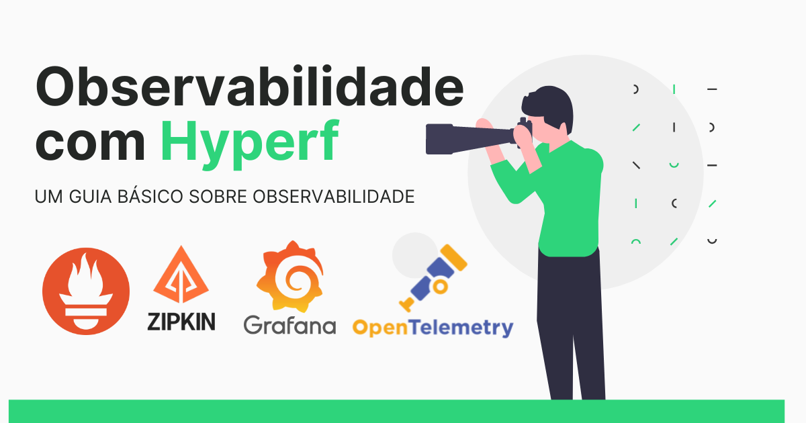

<div align="center">
   
</div>

POC Hyperf Observability
=======================================

[](LICENCE)
[](https://gitlab.com/educa-code-labs/general)

* * *

Esse repositório tem o objetivo de demonstrar como funciona o processo de observabilidade dentro do ecossistema Hyperf. Nesse projeto é feito todas as configurações básicas para você conseguir iniciar e dar os primeiros passos na observabilidade dos seus serviços usando esse framework.

## O que é observabilidade?

Observabilidade é uma propriedade de sistemas complexos que se refere à capacidade de entender e inferir o estado interno e o comportamento de um sistema com base em informações observáveis externamente. É a capacidade de observar, medir e entender o funcionamento de um sistema, permitindo a detecção e resolução de problemas.

## Benefícios da observabilidade

A utilização da observabilidade nos seus serviços traz uma série de benefícios importantes. Veja os exemplos abaixo:

1. **Detecção e resolução rápida de problemas**: A observabilidade permite identificar problemas e anomalias em tempo real. Com métricas, logs e traces disponíveis, você pode monitorar o desempenho e o comportamento do sistema, detectando falhas, gargalos ou comportamentos inesperados.
2. **Melhoria da confiabilidade**: Ao ter uma visibilidade clara do estado interno do sistema, você pode tomar medidas proativas para melhorar a confiabilidade. Monitorar métricas como taxa de erros, tempo de resposta e disponibilidade ajuda a identificar áreas problemáticas e implementar ações corretivas antes que os problemas se tornem críticos. Isso resulta em um sistema mais robusto e confiável.
3. **Depuração e diagnóstico eficientes**: A observabilidade fornece informações valiosas para depurar problemas e investigar falhas. Com logs detalhados e traces de transações, você pode rastrear o fluxo de execução do sistema e entender o contexto em que ocorreu um problema. Isso simplifica o processo de identificação da causa-raiz e acelera o tempo de resolução.
4. **Melhoria do desempenho e otimização**: Ao analisar as métricas de desempenho, você pode identificar gargalos e pontos de melhoria no seu sistema. A observabilidade ajuda a identificar oportunidades de otimização, permitindo ajustar recursos, melhorar algoritmos ou reestruturar componentes para obter um desempenho mais eficiente e escalável.

Em resumo, a observabilidade oferece uma série de benefícios, incluindo detecção e resolução rápida de problemas, melhoria da confiabilidade, depuração eficiente, otimização de desempenho, tomada de decisões informadas e melhoria da experiência do usuário.

## Configuração do ambiente

A seguir, apresentam-se os requisitos e etapas fundamentais para a configuração do seu ambiente a fim de executar o projeto de exemplo.

### Requisitos

- Docker
- Git
- Make

### Instalação

A maneira recomendada de instalar este projeto é seguindo estas etapas:

1. Realize o clone do projeto para a sua máquina

```shell
git clone https://github.com/ReinanHS/poc-hyperf-observability.git
```

2. Acessar as pastas do projeto

```shell
cd poc-hyperf-observability 
docker compose up
```

3. Abra um novo terminal e execute os comandos abaixo:

```shell
docker exec -it hyperf-example-app bash
composer install
composer start
```

4. Abra um novo terminal e execute os comandos abaixo:

```shell
curl http://localhost:9501/ -v
curl http://localhost:9501/external-api -v
curl http://localhost:9501/redis -v
curl http://localhost:9501/database -v
curl http://localhost:9501/exception -v
```

5. Execute o comando abaixo para realizar um teste de carga:

```shell
docker compose run k6 run /scripts/main.js
```

### Visualizar informações

Veja as etapas necessárias para conseguir visualizar as informações geradas.

#### Como funciona a propagação das informações?

A figura abaixo ilustra o fluxo de propagação das informações em nossa aplicação. O Hyperf gera as informações necessárias e as envia para o coletor do Opentelemetry para processamento.

Após o recebimento das informações pelo Opentelemetry, ele as encaminha para os provedores configurados. Para obter uma visão geral do processo em andamento, consulte a imagem abaixo.


#### ZipKin

O Zipkin é uma ferramenta de rastreamento distribuído amplamente utilizada em sistemas distribuídos. Ele permite rastrear e visualizar o fluxo de solicitações entre os diferentes componentes de um sistema, fornecendo informações valiosas para a identificação e solução de problemas de desempenho.

- Acesse a URL [http://127.0.0.1:9411](http://127.0.0.1:9411) para ter acesso de informações que estão disponíveis no ZipKin.

Veja um exemplo das informações que estão disponíveis nesse serviço:

<div align="center">
   
</div>

#### Jaeger

O Jaeger é uma plataforma de rastreamento distribuído desenvolvida para ajudar a monitorar, solucionar problemas e otimizar o desempenho de sistemas distribuídos complexos.

Ele foi projetado para trabalhar em conjunto com o conceito de "rastreamento de solicitações", permitindo acompanhar o fluxo de solicitações em uma arquitetura distribuída e fornecer informações detalhadas sobre o tempo gasto em cada componente envolvido.

- Acesse a URL [http://localhost:16686](http://localhost:16686) para ter acesso de informações que estão disponíveis no Jaeguer.

#### Prometheus

O Prometheus é um sistema de monitoramento e alerta de código aberto, amplamente utilizado para coletar, armazenar e consultar métricas de sistemas distribuídos.

Ele opera seguindo o modelo de coleta de métricas por meio de um agente chamado Prometheus Server. O Prometheus é projetado para ser altamente escalável e eficiente, capaz de coletar e armazenar métricas em tempo real de diversos componentes do sistema, como aplicativos, serviços e infraestrutura.

- Acesse a URL [http://localhost:9090](http://localhost:9090) para ter acesso de informações que estão disponíveis no Promotheus.

#### Grafana

O Grafana é uma plataforma de visualização e monitoramento de código aberto amplamente utilizada para criar painéis interativos e gráficos visuais que exibem dados de métricas e logs.

Com o Grafana, os usuários podem conectar uma variedade de fontes de dados, como Prometheus, InfluxDB, Elasticsearch e muitos outros, para coletar dados e criar visualizações personalizadas. Ele oferece uma ampla gama de opções de painéis e gráficos, permitindo que os usuários criem dashboards informativos e interativos para monitorar o desempenho e a saúde de sistemas, aplicativos e infraestrutura.

- Acesse a URL [http://localhost:3000](http://localhost:3000) para ter acesso de informações que estão disponíveis no Grafana.
- Utilize o usuário `admin` e a senha `secret` para acessar as informações. 
- Na dashboard substitua o valor da variável `app_name` por `otel_poc_hyperf_observability`

Veja um exemplo das informações que estão disponíveis nesse serviço:

<div align="center">
   
</div>

### Software stack

Esse projeto roda nos seguintes softwares:

- Git 2.33+
- Hyperf
- ZipKin
- Jaeger
- Prometheus
- Grafana
- MySQL
- Redis

### Changelog

Por favor, veja [CHANGELOG](CHANGELOG.md) para obter mais informações sobre o que mudou recentemente.

### Seja um dos contribuidores

Quer fazer parte desse projeto? Clique AQUI e leia [como contribuir](CONTRIBUTING.md).

### Licença

Esse projeto está sob licença. Veja o arquivo [LICENÇA](LICENSE.md) para mais detalhes.
